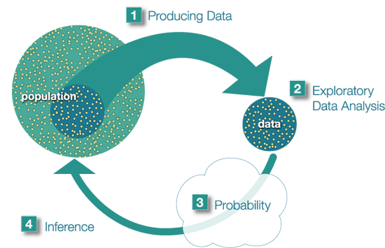

# The Big Picture

The big picture of Statistical Analysis is:

 1. There's a population that we're interested in studying but the
    population is so big (or points are hard to access) that we need 
    to sample (i.e. we produce data)
 2. We do exploratory statistical analysis on the dataset we got in 1.
 3. Based on our knowledge of probability theory, we look at how the 
    sample we're using may differ from the population as a whole, so 
    that we can factor that into our analysis.
 4. Make inferences (draw conclusions) about the entire population 
    based on 2 and 3.

Example:

At the end of April 2005, a poll was conducted (by ABC News and the 
Washington Post), for the purpose of learning the opinions of U.S. 
adults about the death penalty.

 1. Producing Data: A (representative) sample of 1,082 U.S. adults was 
    chosen, and each adult was asked whether he or she favored or 
    opposed the death penalty.
 2. Exploratory Data Analysis (EDA): The collected data were 
    summarized, and it was found that 65% of the sampled adults favor 
    the death penalty for persons convicted of murder.
 3. (and 4). Probability and Inference: Based on the sample result (of 
    65% favoring the death penalty) and our knowledge of probability, 
    it was concluded (with 95% confidence) that the percentage of 
    those who favor the death penalty in the population is within 3% 
    of what was obtained in the sample (i.e., between 62% and 68%). 
    The following figure summarizes the example: 

# Questions

  * At what step do we involve probability distributions?

    **A**: step 3, when we analyze the dataset.

  * Are there variants to the 4 steps?

    **A**: an alternate way of generating a dataset presents when one 
    knows the characteristics of the population under study. In this 
    case, it is possible to generate datasets using this information 
    (without having to go and actually get it). At this point, steps 
    2-4 are the same.

  * How does the big picture embodies the scientific method?

    **A**: Why do we do statistical analysis in the first place? 
    Usually, because we have a claim or statement that we want to 
    corroborate or disprove. For example: taking echinacea makes you 
    heal faster from a cold (or avoid it), people in the US are in 
    favor of gun control, an algorithm A performs better than an 
    algorithm B, etc.

    The null hypothesis ($H_0$) is usually the hypothesis that sample 
    observations result purely from chance. The alternative hypothesis 
    ($H_1$) is the one that contradicts (or explains why) the null 
    hypothesis. The hypotheses are often statements about population 
    parameters like expected value and variance; for example $H_0$ 
    might be that the expected value of the height of ten year old 
    boys in the Scottish population is not different from that of ten 
    year old girls. A hypothesis might also be a statement about the 
    distributional form of a characteristic of interest, for example 
    that the height of ten year old boys is normally distributed 
    within the Scottish population. The outcome of a hypothesis test 
    test is "Reject $H_0$ in favour of $H_1$" or "Do not reject 
    $H_0$".[^1] Note how we cannot assume that $H_0$ is true, we only 
    cannot reject $H_0$ (but it still be false).

    [^1]: http://www.stats.gla.ac.uk/steps/glossary/hypothesis_testing.html 

  * How does the big picture of machine learning relates to the big 
    picture of statistical analysis?

    **A**: TODO

  * How does the big picture relates to "Data Science"? In other 
    words, following the 4 steps of the big picture is certainly part 
    of what a data scientist does? Are there any other type of methods 
    that are followed?

    **A**: TODO
